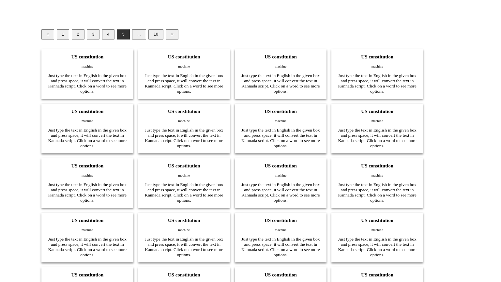

## Intro

Probably there's another library out there that could give you this pagination functionality with less headeache.
I did this to strengthen my mastery of core concepty, who knows a day may come where knowing such could prove beneficial .
I wont be Using this , however it's a great beginner project to learn and it's actually not that easy to implement  hence implementing this gave me a greater understanding of frameworks and how we take this things for granted.